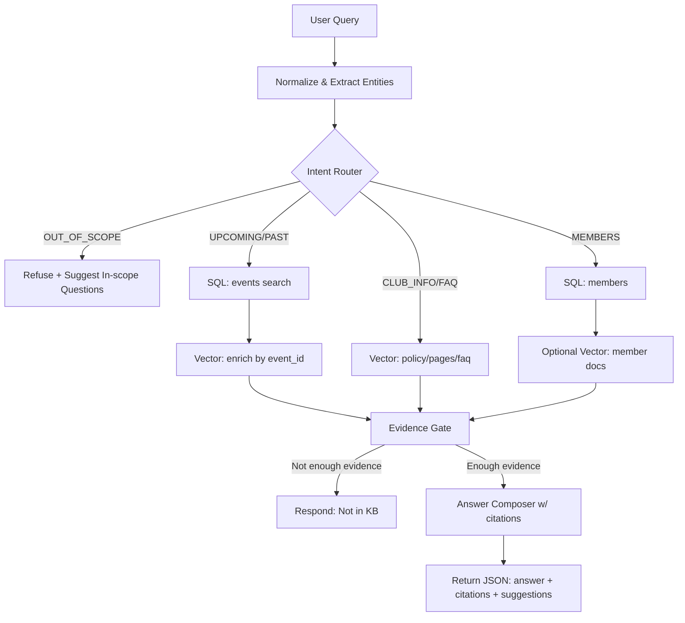

# UEHG Music Club Assistant (Backend)

AI assistant cho landing page CLB am nhac voi RAG + guardrails (in-domain only) + show sap toi/da qua. Embeddings dung Jina API.

## Architecture (system design)

Frontend (AskAI panel + chat widget)
-> POST /chat
-> Intent routing + SQL + RAG (pgvector)
-> Evidence gate
-> Answer + citations + suggested_questions



## Repo structure

- `backend/` FastAPI + LangGraph
- `infra/` docker-compose + SQL migrations
- `content/` markdown data for ingestion
- `docs/` architecture, threat model, runbook
- `adr/` design decisions
- `eval/` testset + eval script
- `.github/workflows/` CI pipeline

## Screenshots

Add screenshots to `docs/screenshots/` (chat widget, AskAI panel, /chat response).

## Quickstart (docker-compose)

1) Copy env

```bash
copy .env.example .env
```

2) Start services

```bash
cd infra
docker-compose up --build
```

3) Ingest content

```bash
python backend/scripts/ingest.py --path content
```

## Ingestion pipeline

- Markdown files in `content/` with frontmatter.
- Chunk size ~500 tokens, overlap ~80.
- Embeddings upsert into `documents`.
- Can set `JINA_API_KEY` de tao embeddings.

Frontmatter example:

```yaml
---
source_type: event
source_id: "uuid-of-event"
event_time: "2026-02-10T19:30:00+07:00"
tags: ["jazz", "acoustic"]
visibility: public
title: "Spring Jam Night"
---
```

4) Test API

```bash
curl -X POST http://localhost:8000/chat -H "Content-Type: application/json" -d '{"message":"Show sap toi khi nao?"}'
```

## Local dev (no docker)

```bash
cd backend
python -m venv .venv
.venv\\Scripts\\activate
pip install -r requirements.txt
uvicorn app.main:app --reload
```

## API

### POST /chat

Request

```json
{
  "message": "Show sap toi khi nao?",
  "session_id": "abc123"
}
```

Response

```json
{
  "answer": "Show gan nhat la ...",
  "citations": [
    {"type": "event", "id": "uuid", "title": "Spring Jam Night", "url": "/events/spring-jam-night"}
  ],
  "suggested_questions": [
    "Dia diem o dau?",
    "Co link mua ve khong?",
    "CLB co tuyen thanh vien khong?"
  ],
  "debug": {
    "intent": "UPCOMING_SHOW",
    "retrieved_chunks": 4,
    "top_score": 0.83,
    "decision": {"allow": true}
  }
}
```

### GET /health

```json
{"status":"ok"}
```

### POST /admin/ingest

- Header: `Authorization: Bearer <ADMIN_API_KEY>`
- Body:

```json
{"path":"content"}
```

## Guardrails

- In-domain only: intent router + keyword gate.
- Evidence gate: thieu bang chung -> tu choi.
- SQL la source of truth cho events/members.

## Observability

- Logs: intent + chunk_count + top_score.
- Metrics: `/metrics` (Prometheus).

## Eval

```bash
python eval/run_eval.py eval/testset.jsonl
```

Note: set `DEBUG=true` de co `debug.intent` trong response (phuc vu intent accuracy).

## Deployment

- Local: docker-compose (postgres + backend).
- Prod: Render (backend) + Aiven (Postgres + pgvector).
- Frontend: Vercel.

See `docs/deployment.md` for step-by-step Render/Aiven/Vercel instructions.

Render API keys (set as env vars):
- `JINA_API_KEY`
- `GROQ_API_KEY`
- `ADMIN_API_KEY`

## Frontend integration

- AskAI panel + chat widget da goi `/chat`.
- Set `NEXT_PUBLIC_API_BASE` trong `frontend/.env` (hoac root `.env` cho compose).

## Notes

- Embedding dimension phai khop giua `JINA_EMBED_DIM` va schema `documents.embedding_jina`.
- `event_time` trong `documents` dung de filter show sap toi/da qua.

See more in `docs/architecture.md`, `docs/threat-model.md`, `docs/runbook.md`.
