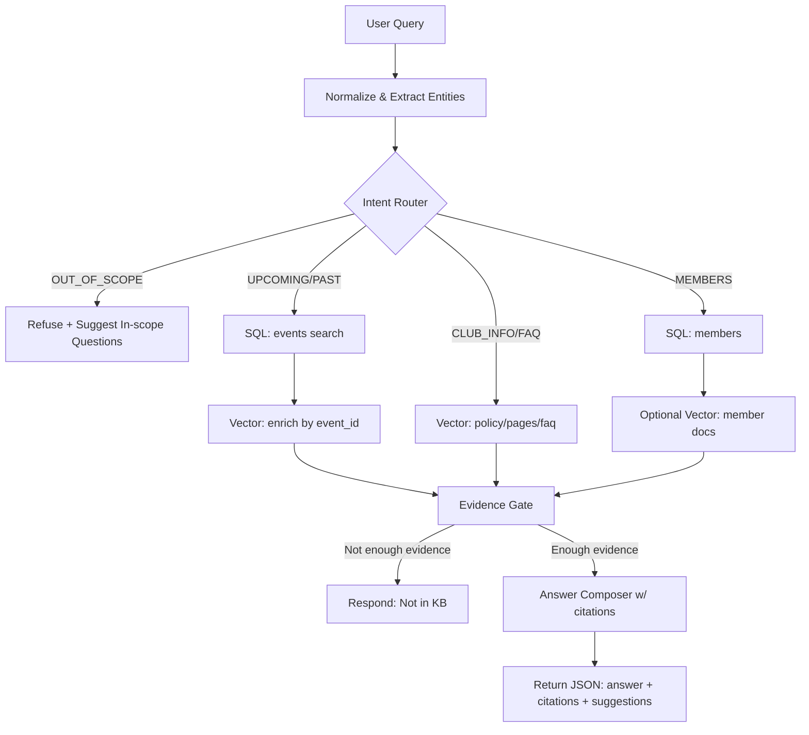

# Architecture

## Tong quan

Frontend (landing page + AskAI widget) goi Backend API `/chat`. Backend thuc hien intent routing, truy van SQL (source of truth), RAG (pgvector) de bo sung noi dung dai, sau do chay evidence gate. Neu thieu bang chung thi tu choi va khong biet.

LangGraph duoc dung de the hien ro flow routing va de mo rong sau nay.

## Data flow

1. User query -> normalize + extract entities
2. Intent router -> UPCOMING_SHOW / PAST_SHOW / CLUB_INFO / MEMBERS / BOOKING_CONTACT / FAQ / OUT_OF_SCOPE
3. SQL query (events/members/faq) khi can
4. Vector search (documents) voi filter `source_type`, `source_id`, `event_time`
   - Embedding provider: Jina API
5. Evidence gate -> allow/deny
6. Groq LLM answer composer -> `answer + citations + suggested_questions`

## Mermaid

## Evidence gate

- Show/Members: SQL phai co ket qua, neu khong -> tu choi.
- Club/FAQ/Booking: phai co du chunk va score >= threshold.
- Logs ghi `intent`, `chunk_count`, `top_score` de theo doi.

## Postgres schema

- Relational: `events`, `members`, `event_performers`, `media`, `faq_structured`.
- Vector: `documents` (embedding_jina + metadata).

`event_time` trong `documents` giup filter show sap toi/da qua.
`embedding_jina` dimension phu thuoc embedding model (xem `JINA_EMBED_DIM`).

## Guardrails

- In-domain only: intent router check ky tu khoa UEHG.
- Refusal: neu khong du bang chung, tra ve "Minh chua co thong tin nay...".
